===============================================
CSS 導入編 
===============================================

CSSについて
===============================================
これまではHTML上でいかに視覚的情報を排除して意味付けをするか、という事を書いて来ました。ここでいよいよ視覚的情報を記述する専用の言語であるCSS(通称スタイルシート)を学びます。

CSS適用の方法
===============================================
方法その1(style属性)
-----------------------------------------------
HTMLタグにstyle属性を付けて、その値にCSSを記述する方法です。CSSの具体的な文法はまだ学んでいませんが、このようになります。

::

	ここだけ色が赤くなります。

方法その2(head内に記述)
-----------------------------------------------
HTMLのheadタグ内にCSSを記述します。

::

	<html>
	<head>
	<title>test page</title>
	
	
	</head>
	<body>
	ここだけ色が赤くなります。 
	spanタグに赤という情報を含めてないのに赤くなります。
	</body>
	</html>

この方法の特徴は、headタグ内にまとめて書いて置いて、bodyタグ内で細かい指定はせずにりようしている点です。

方法その3(外部cssファイルを読み込む)
-----------------------------------------------
「.css」という拡張子のファイルを作成し、それをHTMLファイルから読み込ませます。
headタグ内に、

::

	<link rel="stylesheet" href="design.css" />

と書けば、design.cssを読み込みます。design.cssにcssのみを記述します。まとめると、

index.html
::

	<html>
	<head>
	<title>test page</title>
	<link rel="stylesheet" href="design.css" />
	</head>
	<body>
	ここだけ色が赤くなります。 
	spanタグに赤という情報を含めてないのに赤くなります。
	</body>
	</html>

design.css
::

	span{
		color:rgb(255,0,0);
	}

結果

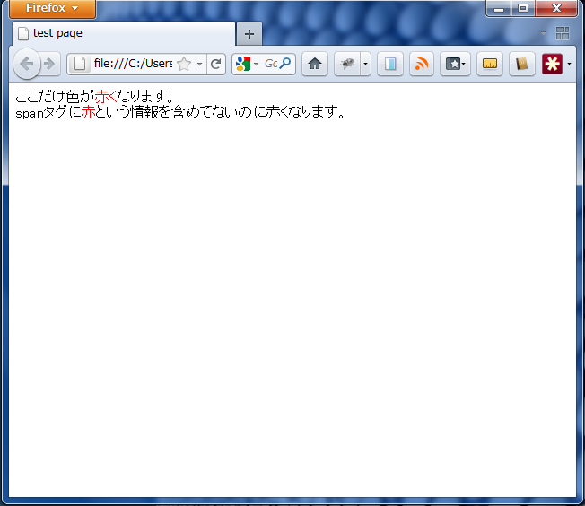

こうすることにより、構造や意味を記述するHTMLと、視覚的要素を記述するCSSを分離することが出来ました。このメリットはとても大きいです。今回のlinkタグを用いて、複数のhtmlファイルがひとつのcssファイルを参照することができます。つまり、複数ページに対して一貫したデザインをまとめて一箇所で済ますことが出来るのです。

さらに、デバイスごとに読み込ませるcssを切り替えることも出来ます。パソコン・ネットブック・タブレットPC・スマートフォン・テレビなど、ネットを閲覧できるデバイスは多種多様ですが、それぞれの画面の大きさや解像度に適したWebデザインを考えると、情報とデザインを分離して、それぞれが見やすいように個別に最適化する意義はとても大きいのです。
	
	
用語解説
===============================================

プロパティ・値
------------------------------------------------
先程のサンプルコードで、

::

	span {
		color:red;
	}

というものがありました。これはspanタグ(まだ説明していませんでしたが、こういうHTMLタグがあります)の文字色は赤だ、という記述です。この場合のspanをセレクタ、colorをプロパティ、redを値と言います。プロパティと値の間にはコロンが入り、プロパティの直後にはセミコロンが入ります。プロパティは複数種類を同時に指定することもできます。例えば「文字色を赤に、文字サイズは大きめ、下線付き」のように。なので、公式(?)はこの様になります。

::

	セレクタ {
		プロパティ:値;
		プロパティ:値;
		プロパティ:値;
	}

div,spanタグ
------------------------------------------------
ここで新しいHTMLタグの紹介です。divタグとspanタグなのですが、これはマークアップする上で意味は全く無い物と考えてください。HTMLは理想的には視覚的要素を一切排除するべきですが、それではWebデザインするための取り付く島がないので、文章上無意味なタグを用意して、これをデザイン用に用います。

id,class属性
------------------------------------------------
id,classというすべてのHTMLタグに付与することが出来る属性があります。前述のスタイルシートの記述ですべてのspanタグの中身が赤くなるものがありましたね。あれを実際に使ってしまうと、ページ内のspanタグすべてが赤くなってしまい、赤くしたくないspanタグがあった場合に対応できません。なのでidやclassなので種類別に分ける事ができます。

id,class属性の値は任意なので、自分で勝手に決めることができます。例えば、

::

	<html>
	<head>
	<title>test page</title>
	<link rel="stylesheet" href="design.css" />
	</head>
	<body>
	
	ここは赤い 
	ここは青い
	
	</body>
	</html>

というHTMLがあったとして、design.cssに

::

	span.red{
		color:red;
	}
	span.blue{
		color:blue;
	}

結果

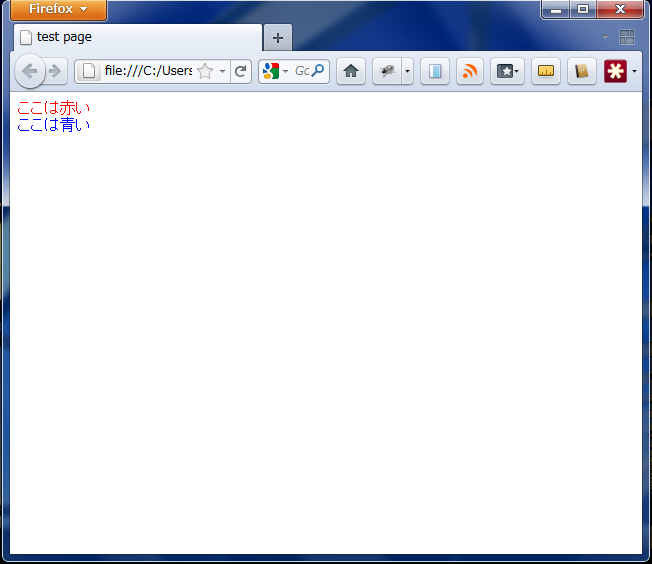

と書いてあると、HTMLをブラウザで表示させると、同じspanタグですが、別々のclass名で指定された色で表示されます。

よって、クラス名を用いたセレクタは、

:: 

	タグ名.class名{
		プロパティ:値;
		プロパティ:値;
		プロパティ:値;
	}

となります。またid名で指定する時は、

::

	タグ名#id名{
		プロパティ:値;
		プロパティ:値;
		プロパティ:値;
	}

しかし、idは同一htmlファイル内では一度しか用いることが出来ないという決まりがあります。

プロパティ一覧

===============================================
*     color
*     font-size
*     font-weight
*     text-decoration
*     border,border-style,border-width
*     background-color
*     background-image
*     display
*     width
*     height
*     margin
*     padding
*	float
*	コメント

color
---------------------------------------------------------
文字色を設定します。

HTML

::

	<html>
	<head>
	<title>test page</title>
	<link rel="stylesheet" href="design.css" />
	</head>
	<body>
	字の色が変わる
	</body>
	</html>

CSS

::

	span{
		color:red;
	}

結果

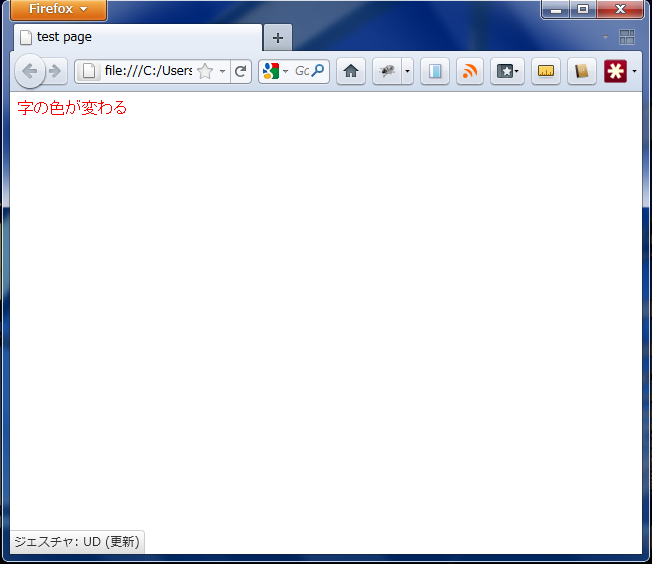

colorプロパティの値は、red,blueのように英語で色の名前を指定しても良いのですが、色の単語だけではすべての色を表現できるわけではありません。厳密な色の定義式にはRGBという記法があります。RGBとはRed,Green,Blueの頭文字をとったもので、色成分の強さの重ねあわせで全ての色を表します。

::

	span{
		color:rgb(255,0,0);
	}
	
のように記述します。カンマ区切りで、一つ目がR,二つ目がG,三つ目がBの色の強さを表します。数字は0から255までの半角文字が使えます。もし16進数を扱えるならば、

::

	span{
		color:#ff0000;
	}
	
のように書いても構いません。

ちなみに、上記の色は赤成分が最大値をとっていて、他の値は0なので、表示させると文字色は真っ赤になります。いろいろ数字を細かく変えて遊んでみるのも面白いです。「rgb カラーチャート」などで検索すると、色見本とRGB値の表が出てくるので、イメージしやすいかもしれません。

font-size
---------------------------------------------------------
文字通り、文字の大きさを設定します。

HTML

::

	<html>
	<head>
	<title>test page</title>
	<link rel="stylesheet" href="design.css" />
	</head>
	<body>
	ここだけ字が大きい
	</body>
	</html>

CSS

::

	span{
		font-size:60px;
	}

結果

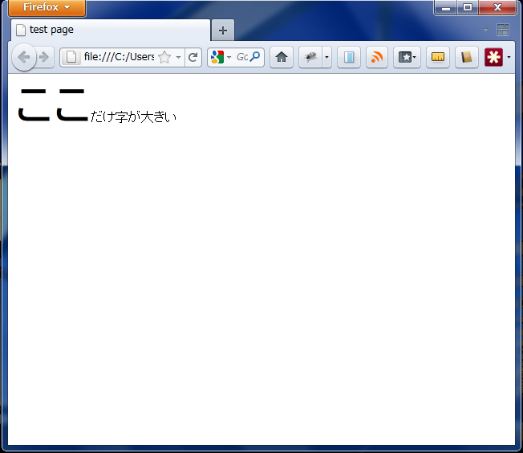

値は単位を持ちます。単位にはem,px,cmなど様々あるので興味があれば調べてみてください。本講座ではpx(ピクセル:画面のつぶつぶ一つ分)のみを用いるので、調べなくても読み進めることが出来ます。

font-weight
---------------------------------------------------------
フォントの太さを指定します。数値によって太さを指定できますが、多くのブラウザでは、太字か・太字でないか、程度しか調整できません。標準の太さは数値だと400、キーワードだとnomalです。

HTML

::

	<html>
	<head>
	<title>test page</title>
	<link rel="stylesheet" href="design.css" />
	</head>
	<body>
	ここだけ字が太い
	ここだけ字が太い
	ここだけ字が太い
	</body>
	</html>

CSS

::

	span.font1{
		font-weight:700;
	}
	span.font2{
		font-weight:nomal;
	}
	span.font3{
		font-weight:bold;
	}

結果

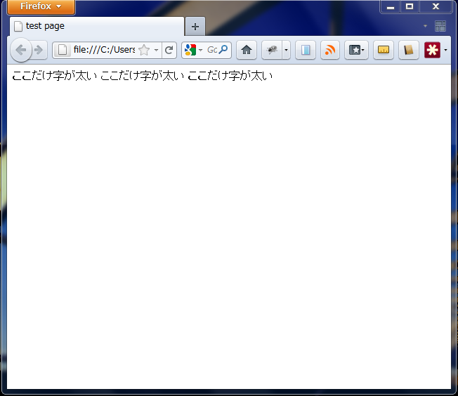

試しに表示させてみればわかると思いますが、あまり代わり映えしないのであまり使われません。デフォルトで太字になっている要素を通常の太さにしたい時にfont-weight:nomal;を指定する事がたまにあります。

text-decoration
---------------------------------------------------------
フォントの装飾について指定します。

HTML

::

	<html>
	<head>
	<title>test page</title>
	<link rel="stylesheet" href="design.css" />
	</head>
	<body>
	下線
	上線
	無効化
	</body>
	</html>

CSS

::

	span.font1{
		text-decoration:underline;
	}
	span.font2{
		text-decoration:overline;
	}
	span.font3{
		text-decoration:none;
	}

結果

border-color,border-style,border-width,
---------------------------------------------------------
ボーダー(枠)について指定します。

HTML

::

	<html>
	<head>
	<title>test page</title>
	<link rel="stylesheet" href="design.css" />
	</head>
	<body>
	ボーダーのテスト
	
ボックスの中身

	ボーダーのテスト
	</body>
	</html>

CSS

::

	div.box1{
		border-style:solid;
		border-width:5px 1px 10px 1px;
		border-color:rgb(255,0,255);
	}

結果

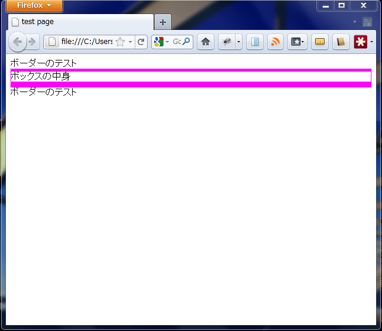
	
border-styleの値は、solid以外も取れますが、他の値については調べてみてください。

ブロック要素、インライン要素について
---------------------------------------------------------
ブロック要素・インライン要素とはスタイルシートを適用する上で重要な概念です。まずは以下のソースを見てください。どのように表示されるでしょうか。

HTML

::

	<html>
	<head>
	<title>test page</title>
	<link rel="stylesheet" href="design.css" />
	</head>
	<body>
	<h1>ブロック要素</h1>
	<h1>ブロック要素</h1>
	<h1>ブロック要素</h1>
	<h1>ブロック要素</h1>
	<h1>ブロック要素</h1>
	<strong>インライン要素</strong>
	<strong>インライン要素</strong>
	<strong>インライン要素</strong>
	<strong>インライン要素</strong>
	</body>
	</html>

結果

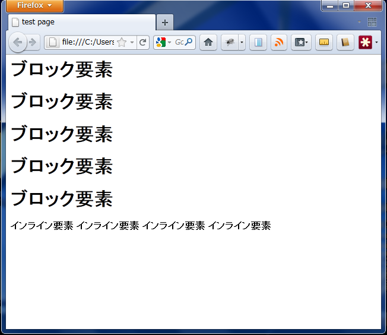

違いがわかりますか？h1は改行タグを含めていませんが、改行されています。一方strongは改行されずにそのまま続いて行きます。ある意味予想通りの挙動です。

この2者の違いがブロック要素かインライン要素かの違いです。h1-h7,img,divなどがブロック要素、strong,spanなどがインライン要素です。

冒頭でdiv,spanを紹介しましたが、この2者の違いはブロック要素かインライン要素か、という点のみです。

background-color
---------------------------------------------------------
背景色について指定します。

HTML

::

	<html>
	<head>
	<title>test page</title>
	<link rel="stylesheet" href="design.css" />
	</head>
	<body>
	ニュートンは<strong>落ちるリンゴ</strong>を見て万有引力を発見したのではない。
	</body>
	</html>

CSS

::

	strong{
		background-color:rgb(0,255,0);
		color:rgb(255,255,255);
		
	}

結果

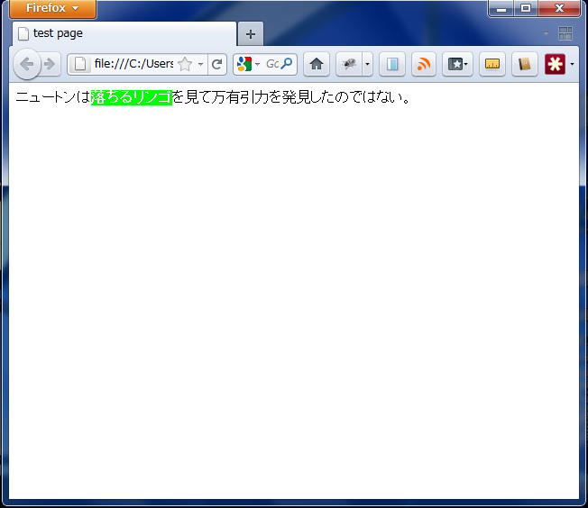

background-image
---------------------------------------------------------
先程は背景色について指定しましたが、背景に画像も適用できます。

HTML

::

	<html>
	<head>
	<title>test page</title>
	<link rel="stylesheet" href="design.css" />
	</head>
	<body>
	ニュートンは<strong>落ちるリンゴ</strong>を見て万有引力を発見したのではない。
	</body>
	</html>

CSS

::

	strong{
		background-image:url("bg.png");
	}

結果

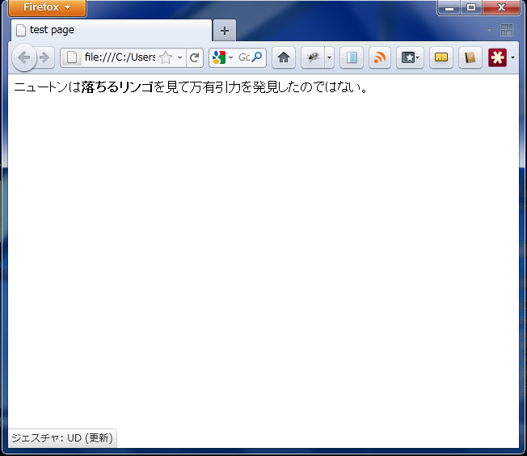

rgb(0,0,0)の様な書式でurl("")というのが初めて出てきました。括弧内のダブルクオーテーションを書き忘れないようにしてください。

display
---------------------------------------------------------
ブロック要素か、インライン要素かをCSSから指定できるオプションです。

HTML

::

	<html>
	<head>
	<title>test page</title>
	<link rel="stylesheet" href="design.css" />
	</head>
	<body>
	spanタグなのにブロック要素になっている
	spanタグなのにブロック要素になっている
	spanタグなのにブロック要素になっている
	
divタグなのにインライン要素になっている。

	
divタグなのにインライン要素になっている。

	
divタグなのにインライン要素になっている。

	</body>
	</html>

CSS

::

	.hoge {
		display:block;
	}
	.foo {
		display:inline;
	}

結果

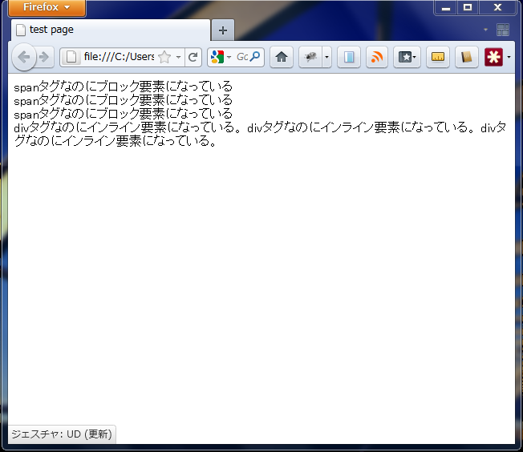

width
---------------------------------------------------------
ブロック要素のみ有効なオプションです。要素の横幅を指定します。単位はpx,%などを使うことができます。サンプルソースは以下のheightオプションの項にあります。

height
---------------------------------------------------------
ブロック要素の高さを指定します。widthと使い方は全く同様です。

HTML
::

	<html>
	<head>
	<title>test page</title>
	<link rel="stylesheet" href="design.css" />
	</head>
	<body>

	

		300px x 400px red
	

	

		400px x 300px blue
	

	</body>
	</html>

CSS

::

	.hoge-1 {
		height:300px;
		width:400px;
		background-color:rgb(255,0,0);
	}
	.hoge-2 {
		height:400px;
		width:300px;
		background-color:rgb(0,0,255);
	}

結果

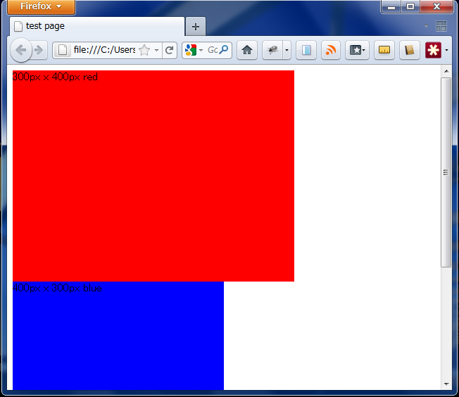

margin
---------------------------------------------------------
ブロック要素の余白を指定します。値は1,2,4個を取ることが出来、

*	1個ならば四辺すべての値
*	2個ならば上下の値
*	4個ならば上右下左の値(上から時計回りと覚える)

をとります。また、

*	margin-top
*	margin-right
*	margin-bottom
*	margin-left

という1つの値をとるオプションがありこれらを用いて一箇所だけ指定することも出来ます。

値の単位については、px,%(画面サイズを100%とする)などを用いますが、autoという特別な値をとることも出来ます。auto値の使い方については後述のサンプルソースを参照してください。

padding
---------------------------------------------------------
ブロック要素の内側の余白を指定します。値は1,2,4個をとり、用法はwidthと同様です。

HTML

::

	<html>
	<head>
	<title>test page</title>
	<link rel="stylesheet" href="design.css" />
	</head>
	<body>

	

		あいうえおかきくけこさしすせそたちつてとなにぬねのはひふへほまみむめもやゆよらりるれろわをんあいうえおかきくけこさしすせそたちつてとなにぬねのはひふへほまみむめもやゆよらりるれろわをんあいうえおかきくけこさしすせそたちつてとなにぬねのはひふへほまみむめもやゆよらりるれろわをん
	

	
あいうえおかきくけこさしすせそたちつてとなにぬねのはひふへほまみむめもやゆよらりるれろわをんあいうえおかきくけこさしすせそたちつてとなにぬねのはひふへほまみむめもやゆよらりるれろわをんあいうえおかきくけこさしすせそたちつてとなにぬねのはひふへほまみむめもやゆよらりるれろわをん
	

	</body>
	</html>

CSS

::

	.hoge-1 {
		width:400px;
		background-color:rgb(255,0,0);
	
		margin:50px auto ;
		padding-left:30px;
	}
	.hoge-2 {
		width:300px;
		background-color:rgb(0,0,255);
	
		margin-top:30px;
		padding:30px;
	}

結果

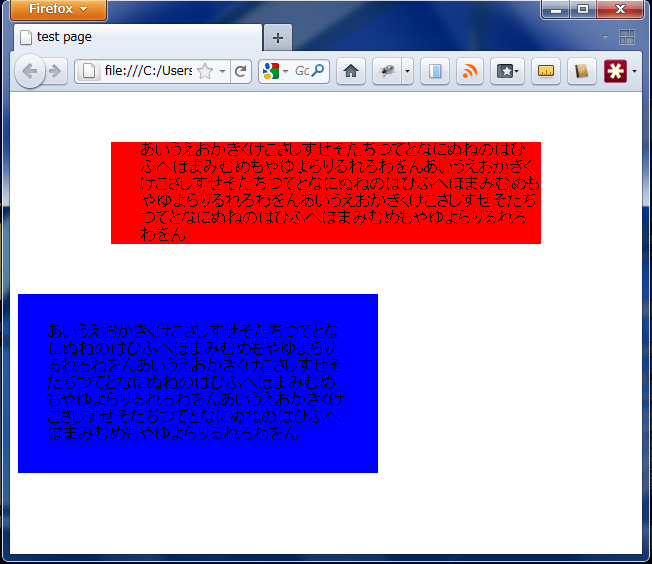

いよいよレイアウトが実践的にできそうだと思えてきたのでは？次のfloatでレイアウトに必要な基礎的な技が全て手に入ります。

float
------------------------------------------
floatとはブロック要素の回りこみを指定するオプションです。回りこみに関しては次のソースを確認すればわかると思います。

HTML
::

	<html>
	<head>
	<title>test page</title>
	<link rel="stylesheet" href="design.css">
	</head>
	<body>
	

		ボックス内
	
	ここに回りこむテキストが来ます。分かりやすいようにある程度の量ループします。ここに回りこむテキストが来ます。分かりやすいようにある程度の量ループします。
	  
	

		ボックス内
	
	ここに回りこむテキストが来ます。分かりやすいようにある程度の量ループします。ここに回りこむテキストが来ます。分かりやすいようにある程度の量ループします。
	</body>
	</html>

CSS

::

	.box1 {
		width:50px;
		height:50px;
		background-color:red;
	}
	.box2{
		width:50px;
		height:50px;
		background-color:red;
		float:right;
	}
	body{
		width:400px;
	}

結果

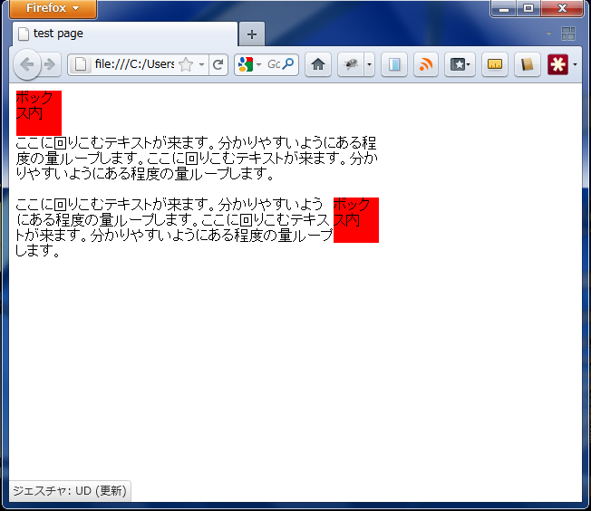

上記のcssはfloatによる挙動の違いをはっきりさせるためにかなり極端な値を指定しています。実践的ではありませんが、floatが何なのか、なんとなくでも理解してもらえれば、と思います。

コメント
------------------------------------------
CSSにもコメントを書き残しておく事が出来ます。

CSS
::
	body{
		color:rgb(255,0,0);
		/*color:rgb(255,255,255);*/
	}

この様に書くと、bodyタグ内(つまり全体)の文字色が白ではなく赤くなります。

擬似クラス
------------------------------------------

