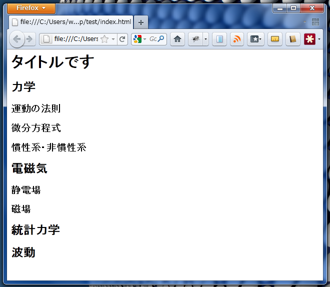
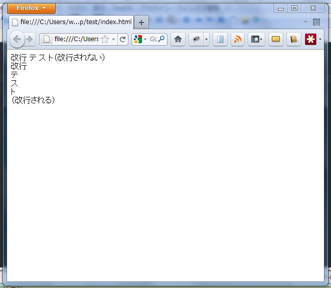
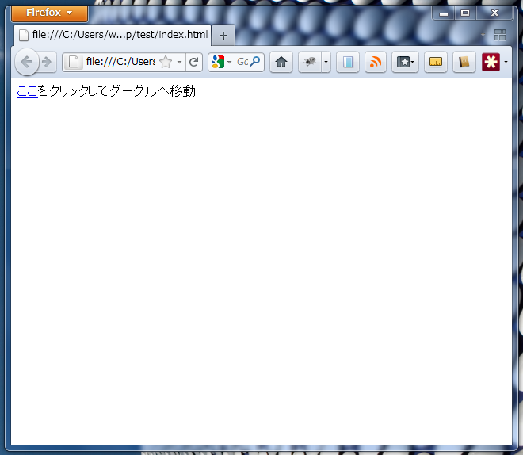
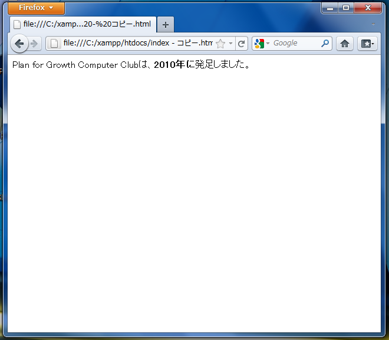
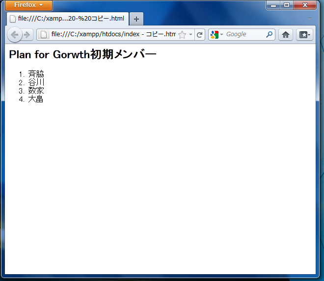
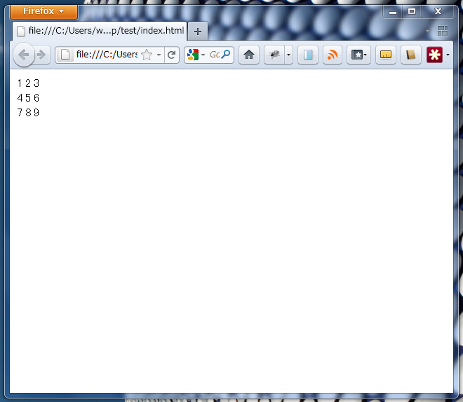
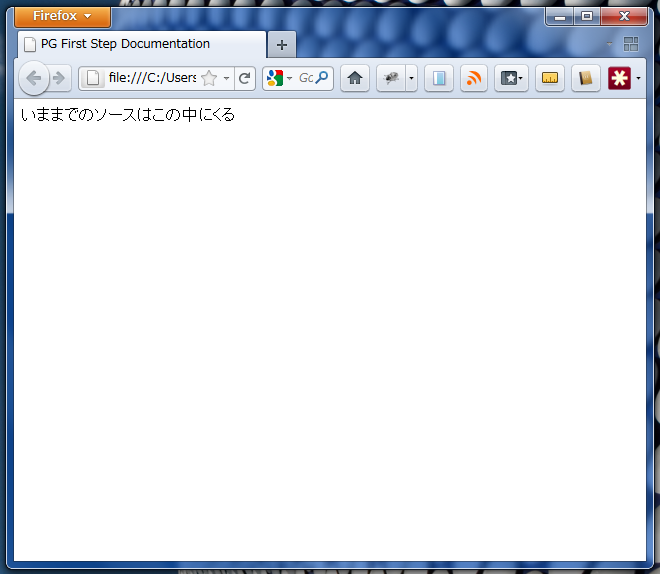

===============================================
HTML 導入編
===============================================

タグとは
===============================================
いよいよHTMLを書き始めます。HTMLは「タグ」という単語で文章を装飾していきます。学校の授業でノートをとるときに、教科書の新しい章に入ったときにに、あなたはその章の名前を何かしらの形で装飾すると思います。2行分の大きさで書く、色を使う、下線を引く、などです。

ここではそのような個人差の大きい視覚的な要素を、意味でとらえて一般化します。

と書きましたが意味は分かりましたか？章の名前をどの様に装飾するかは個人差が大きいわけですが、誰がどのように装飾してもみな一様にそれは「見出し」を意味します。HTMLでは、「ここからここまで赤マーカーかつ下線」の様に視覚ではなく、「ここからここまで章の見出し」の様に、意味を記述する言語なのです。意味を記述する事を「マークアップ」と言います。

今回の例で章の名前をマークアップするならば「<h1>第一章 電磁気</h1>」となります。ここで、前後のカッコに囲われている(今回はh1)の事を、「タグ」と呼びます。タグには開きタグと閉じタグがあり、閉じタグにはカッコとタグ名の間にスラッシュが入ります。見出しの範囲がそこまでで終了する事を示しています。

タグ一覧
===============================================
今回学習するタグの一覧です。当然ながらHTMLはここにあるよりもっと多くのタグを持っています。これらは今回の学習において必要最小限のものです。

*     h1-h7
*     br
*     a (属性について)
*     img
*     strong
*     ul,ol,li
*     table,tr,td
*     html,head,body,title
*     コメント

h1-h7
------------------------------------------------------------------------------
見出しを表すタグです。

::

     <h1>タイトルです</h1>
     <h2>力学</h2>
     <h3>運動の法則</h3>
     <h3>微分方程式</h3>
     <h3>慣性系・非慣性系</h3>
     <h2>電磁気</h2>
     <h3>静電場</h3>
     <h3>磁場</h3>
     <h2>統計力学</h2>
     <h2>波動</h2>

結果

それぞれの見出しの大きさに対してh1からh7まで割てることが出来ます。新聞の一面などを見て、「もしHTMLでこの新聞を書くなら、この見出しはh3だな」などと考えてみると分かりやすいかもしれません。

br
------------------------------------------------------------------------------
改行を表すタグです。実はHTMLというものはソース上改行されていたとしても、実際ブラウザで表示される時には改行は無効化されます。なので改行を示すタグとしてbrタグを用います。

::

     改行
     テ
     ス
     ト（改行されない） 
     改行 テ ス ト （改行される）

結果

このように、ソース上改行されていても、ブラウザで表示されるときは改行されているようには見えません。なのでこの改行はHTMLを書いている人にしか見えません。よって、自分が編集しやすいように使うかとが出来ます。

このタグには閉じタグがありません。改行は見出しなどとは違い範囲を示すものではないからです。このように閉じタグのないタグも存在します。

a
------------------------------------------------------------------------------
インターネットを見ていると、クリックしてページ移動することがとても多い事と思います。このようにクリックして移動できるものを「リンク」と呼びますが、リンクを作るタグがaタグです。ただリンクとなると、そのタグの中にリンク先(ページ移動先)を指定してやる必要があります。

::

     <a href="http://www.google.com/">ここ</a>をクリックしてグーグルへ移動

結果

この例で言うと「href」の事を「属性」と呼び、「http://www.google.com/」の部分を「値」と呼びます。なので、タグの書き方は、

::

     <(タグ名) (属性名)="(値)" >(中身)</(タグ名)>

となります。

img
------------------------------------------------------------------------------
画像をページ中に挿入します。画像のファイル名を指定する必要があるので、このときは「src」属性を使わなくてはなりません。また閉じタグは必要ありません。

::

     ↓の写真かわいいよね！
     
     かわいいでしょ？

strong
------------------------------------------------------------------------------
「強調」を表すタグです。結果的に太字で表示されますが、何度も書いているとおりに、重要であるという意味付けのために用いてください。閉じタグは必須です。

::

     Plan for Growth Computer Clubは、<strong>2010年に</strong>発足しました。

結果

ul,ol,li
------------------------------------------------------------------------------
リストをマークアップします。なんどでも書きますが、リストというレイアウトのためにこれらのタグを用いてはなりません。

番号付きリストを作る場合はまずolタグを、箇条書きリストを作る場合はまずulタグを書き、そのタグの開きタグから閉じタグまでの間に、さらにliタグを付け足します。この時「liはol(またはul)にネストされている」と言います。このネストの文法的ルールをきっちり守ってください。

::
	
	<h2>Plan for Gorwth初期メンバー</h2>
	<ol>
	<li>斉脇</li>
	<li>谷川</li>
	<li>数家</li>
	<li>大畠</li>
	</ol>

結果

ここから本格的なタグの階層構造を見て取ることが出来ます。liタグはolもしくはulの直下にのみ書くことが出来ます。また、このサンプルソースの場合のliタグをolタグの子要素といい、olをliの親要素と呼びます。

table,tr,td
------------------------------------------------------------------------------
表をマークアップします。tableタグの直下に「行」を表すtrタグを、そのtrタグの直下に、「セル」を表すtdタグを書きます。

::
	
	<table>
	<tr><td>1</td><td>2</td><td>3</td></tr>
	<tr><td>4</td><td>5</td><td>6</td></tr>
	<tr><td>7</td><td>8</td><td>9</td></tr>
	</table>

結果

「テーブルレイアウト」というウェブデザイン上のタブーが存在します。それは、tableタグの意味としてのマークアップを無視し、レイアウトのために用いるウェブデザインの手法です。現時点でテーブルレイアウトを用いずに複雑なレイアウトは実現できますが、後に学ぶCSSで実現できるので、絶対にテーブルレイアウトはしないようにしてください。

html,head,body
------------------------------------------------------------------------------
実は今まで書いてきたHTMLは簡略化された文法でした。正式な書き方をお教えします。

::

	<!DOCTYPE html>
	<html>
	<head>
	<title>PG First Step Documentation</title>
	</head>
	<body>
	いままでのソースはこの中にくる
	</body>
	</html>

結果

html,head,body,titleという新しいタグがあります。実は今まで書いて来たHTMLは正式に書くならば、すべてbodyタグの中に来るべきものだったのです。当然ながら、これまでのh1,a,li,tableなどのタグは、body内でしか通用しません。

titleというタグで囲われたテキストは、その名のとおり、ページ名を表しています。ブラウザのウィンドウのタイトルに表示されるテキストがこれです。

また、冒頭の!DOCTYPEというのは完全に「おまじない」だと思っていてください。意味はわからないけど、必ず冒頭にこう書かなくてはいけません。（書くように、と推奨されています。）

コメント
------------------------------------------------------------------------------
コメントを表します。コメントというのは、ブラウザで表示される上で無視されるテキストの事です。一見すると無意味な気がしますが、編集する時に仮のタグをコメントアウトしたり、目印として用いることが多いです。コメントを上手に使うと開発の労力を軽減できます。ソースの可読性も増します。

::

	<!--ここは表示されません-->
	<!--h1>ここは表示されません。</h1-->
	ここは表示されます。
	<!--↑のように特定の範囲のタグを表示させないときにも使えます。-->

相対パス・絶対パス
------------------------------------------------------------------------------
これはHTMLタグの概念ではないのですが、HTML編の最後に「相対パス」という物を学びます。

「絶対」と「相対」は反対語で、主観・視点によって対象が変わるのが相対、変わらないのが絶対、という意味です。「パス」とは「アドレス」と同じ意味で、コンピューター上のデータの場所を意味します。

データの場所ではなく、キーボードの配列に例えると、「手前から2列め、左から3番め」というのが絶対パスで、「Fキーの左下」というのが相対パスです。絶対パスで指定すると、自分がどのキーにいたとしてもCにたどり着けますが、後者の相対パスでは、「Fキー」という視点から見たときのみCキーにたどり着けます。これが「絶対パス」と「相対パス」の違いです。

次に「ディレクトリ」の上位と下位の理解です。

「ディレクトリ」とはいわゆる「フォルダ」のことです。もともとはコンピューター独自の概念であったディレクトリという言葉ですが、文房具のフォルダと役割が全く同じであったため、一般層への普及のため馴染みやすい言葉に置き換わったものです。

windowsにおいてはパスは「C:¥Program Files¥hogehoge」、MacOS(それとLinux,というよりUNIX全般)においては「/dev/sda/hogehoge」の様な文法をしています。今回はMacOSの記述を例に説明します。(Windowsユーザーの方も問題なく理解出来ます。)

たとえば、workspaceフォルダの中に、index.htmlとimage.pngがあったとき、index.htmlからimgタグでimage.pngを貼り付けるとき、

::

	

と書けば、index.htmlを開いたときに画像が表示されます。この時のsrc属性の値である「image.png」は相対パスです。試しに、workspaceフォルダの中に「test」フォルダを作って、その中に、index.htmlとimage.pngを移動して、そして移動先のindex.htmlを開くと、画像の絶対パスは変化したのに無事表示されるはずです。

相対的な位置関係が変化しないなら、どこへいってもリンクが保持される事が相対パスのメリットです。

では次の場合はどうでしょう。

*	workspace/

	*	index1.html
	*	image1.png
	*	dir/
	
		*	index2.html
		*	image2.png

ディレクトリの階層に差がある時に、例えばindex1.htmlからimage2.pngを参照する時は

::

と書きます。index1.htmlから参照するので、index1.htmlからの相対パスので指定します。

逆に、index2.htmlからimage1.pngを参照する時は

::

と書きます。「../」が一階層分上がる、という意味です。「上」というのは、より/が少ない方のディレクトリを言います。

(オンライン上のサーバーに、ローカル環境で作ったファイルをアップロードする時は、相対パスで記述しておくと、サーバー上でも問題なくリンクが保持されます。)